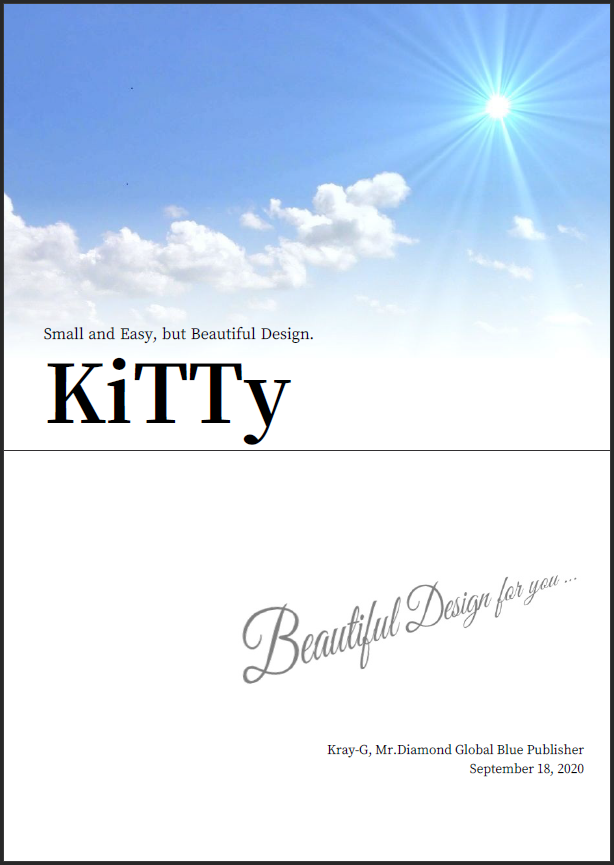

# Kinx Tiny Typesetting

## Introduction


Tiny typesetting system as an additional module for Kinx.

* KiTTy's User Guide.
    * User Guide in English ... ([PDF](https://github.com/Kray-G/kinx-tiny-typesetting/raw/master/docs/userguide/KiTTy_en.pdf))
    * User Guide in Japanese ... ([PDF](https://github.com/Kray-G/kinx-tiny-typesetting/raw/master/docs/userguide/KiTTy_jp.pdf))

> Notes: User guide is not updated and same as Kinx repo version now. It will be updated to suit this repository soon.

The above pdf files are also generated by KiTTy.
KiTTy's source text is currently written in Markdown.
Some text structures will be supported in future.

* The source text of KiTTy's User Guide.
    * User Guide in English ... ([Markdown](https://github.com/Kray-G/kinx-tiny-typesetting/raw/master/docs/userguide/KiTTy_en.md))
    * User Guide in Japanese ... ([Markdown](https://github.com/Kray-G/kinx-tiny-typesetting/raw/master/docs/userguide/KiTTy_jp.md))

## Installation

* Install [Kinx](https://github.com/Kray-G/kinx) first.
* Locate files of this project to the folder where Kinx was installed.
    * (detail description is under construction)

## Example

### Markdown to PDF

#### Markdown Source

Here is the head of the [source text](https://github.com/Kray-G/kinx-tiny-typesetting/raw/master/docs/userguide/KiTTy_en.md) of User Guide.

```markdown
# Introduction

First, this section introduces a KiTTy itself and shows a comparison to alternative softwares,
and introduces a value of KiTTy and use case of KiTTy.
And also, it shows supported features.

## What is KiTTy

**KiTTy** means **Ki**nx **T**iny **Ty**pesetting,
which is a simple typesetting system implemented by Kinx.
It also provides a translator from Markdown,
then you can typeset a Markdown document and can get a beautiful document.
This document itself is also the example typeset by this system.

The objective is similar to \\LaTeX,
it is an objective to typeset beautifully for a document managed as a text file.
To be concretely, it is never going to be alternative,
but the objective is being more useful in the use case like your personal situation by followings.

*   Keeping a small system.
*   Pretty beautiful output.
*   Directly output as PDF file.

KiTTy is small but it has a simple feature to typeset it beautifully,
and it is a typesetting system to output PDF directly from Markdown document.

(...omitted...)
```

#### Output Image

This document is a Book Style, so the Chapter text will be started the odd page on the left side.


## Table Of Contents

Table of contents will be automatically generated with the command `toc` below.

```html
<toc with="lof,lot"/>
```

`toc` can have a list of tables and a list of figures. By the above command both lists are generated.

* `lot` ... List Of Tables
* `lof` ... List Of Figures


## Cover Page

Cover page can have a cover image. Here is an example.



## License

This project is licensed under the **MIT License**.
See the [LICENSE](LICENSE) file for details.
About the licenses of internal used libraries, follow the licenses of each library.
See [docs/licenses](docs/licenses) folder for details.
